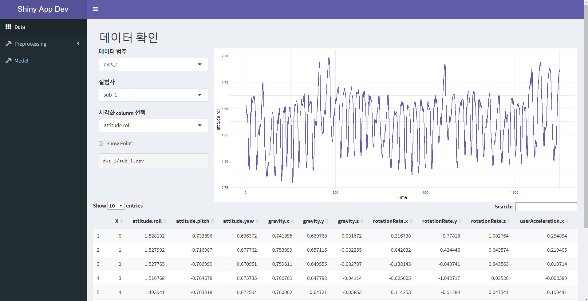

# R Shiny App 개발하기

---

---

비정형데이터 분석 프로젝트 Shiny App만들기 입니다.

목적 : 휴대전화 센서데이터의 Data를 가지고 App을 만들기

# 사용한 library

앱을 사용하기 전에 라이브러리를 다운받아야 합니다.

```python
# install.packages("shiny")
# install.packages("shinydashboard")
# install.packages("tidyverse")
# install.packages("DT")
# install.packages("pracma")
# install.packages("seewave")
# install.packages("changepoint")

library(shiny)
library(shinydashboard)

library(tidyverse)
library(DT)
library(pracma)
library(seewave)
library(changepoint)
```

# 소스 구조도

APP의 구조도 입니다.

```python
R_Shiny_App
 │  app.R
 │  .RData
 └─myapp
         Make_RData.R
         server.R
         ui.R
```

# App 사용하기

```r
setwd("현재 APP의 경로")

# 사용할 Data를 받습니다.
load( "./.RData" )
runApp("myapp")
```

# App main 화면

App의 화면구성은 사이드바와 메인 화면으로 구성 됩니다.

사이드 바에는 메인화면을 변경할 수 있는 네비게이션 버튼이 존재합니다.



# 사이드바


- Data : 원본 데이터를 보여줍니다.
- Preprocessing : 전처리 데이터를 보여줍니다.
    - Statistics : 통계 전처리
    - Peak : 피크 전처리
    - Change Point : 변환점 전처리
    - Spectral Analysis : 주파수분석 전처리

# Data


- 데이터 범주 : 실험자의 운동 상태를 선택합니다.
- 실험자 : 실험자를 선택합니다. ( 1 ~ 24 )
- 시각화 colunm 선택 : 선 그래프로 그릴 열을 선택합니다.
- show Point : 선그래프에 점을 추가합니다.

사용한 데이터 정보

[mmalekzadeh/motion-sense](https://github.com/mmalekzadeh/motion-sense)

# Preprocessing


- Filter Row Activity : 원하는 운동 상태를 선택해서 그래프와 Data를 Filterling 합니다.
- 시각화 colunm 선택 : 시각화할 열을 선택합니다.
- 시각화 선택 : 시각화로 보여줄 그래프를 선택합니다.

# Model


- Data 선택 : Modeling할 Data를 선택합니다.
- RF Model : Random Forest의 모델링 결과를 보여줍니다. 모델의 결과는 10 Fold Crossing 한 결과 입니다.

# 참고한 문서

[Shiny Dashboard Structure](https://rstudio.github.io/shinydashboard/structure.html#boxes)

[Shiny - Tutorial](https://shiny.rstudio.com/tutorial/)